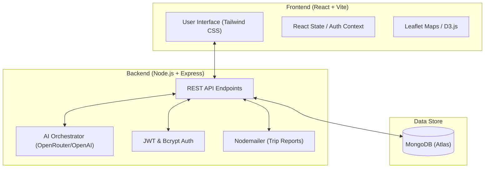
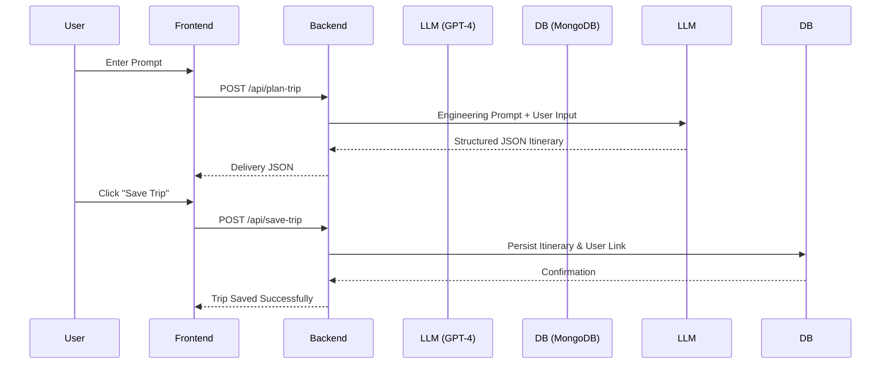

# ✈️ AI Travel Agent - Deep Analysis & Documentation

Welcome to the **AI Travel Agent**, a state-of-the-art, AI-powered travel planning and collaboration platform. This project leverages Large Language Models (LLMs) to transform simple travel prompts into comprehensive, data-driven itineraries.

---

## 🛠️ Document Purpose
This document provides a deep-dive analysis of the AI Travel Agent ecosystem. It covers the system architecture, working flow, component breakdown, and technical implementation details for both the Frontend and Backend systems. It serves as a comprehensive guide for developers, stakeholders, and users to understand the "under the hood" logic of the platform.

---

## 🏗️ System Architecture

The application follows a modern **MERN** stack architecture (MongoDB, Express, React, Node.js) with a specialized **AI Orchestration Layer** in the backend.



---

## 🔄 Working Flow: The Planning Lifecycle

1.  **Input Phase**: User provides a prompt (e.g., *"Trip to Manali from Delhi, 3 days, budget 10k, luxury but affordable"*) via the specialized Input HUD.
2.  **Request Phase**: The Frontend sanitizes the input and sends a POST request to `/api/plan-trip`.
3.  **AI Intelligence Phase**:
    *   The Backend constructs a rigorous system prompt.
    *   It communicates with **GPT-4o-mini** (via OpenRouter).
    *   The LLM generates a structured JSON object containing:
        *   Geospatial coordinates for origin/destination.
        *   Granular budget breakdowns (Refreshments, Local Transport, etc.).
        *   Multi-modal transport comparisons (Train vs. Bus vs. Car).
        *   Dynamic weather and safety insights.
4.  **Response Phase**: The Backend parses the JSON and streams it back to the client.
5.  **Rendering Phase**: The Frontend uses advanced UI components (Expense Tracker, Itinerary Timeline, Global Globe) to visualize the plan.
6.  **Persistence Phase**: User saves the trip, which is stored in MongoDB, and can share it via email or real-time collaboration.

---

## 🧩 Core Components

### Frontend Components
- **`Planner.tsx`**: The heart of the app. Handles AI prompt submission and renders the full dashboard.
- **`CostComparison.tsx`**: A data visualization component that compares travel duration, costs, and pros/cons across different vehicles.
- **`ExpenseTracker.tsx`**: Interactive interface for users to monitor their spending against the AI-suggested budget.
- **`TripCollaboration.tsx`**: Manage invitations and permissions for group travel.
- **`HotelPreview.tsx`**: Previews suggested accommodations with descriptions and booking links.
- **Global Globe (`cobe`)**: An interactive 3D globe visualizing origin and destination connections.

### Backend Services
- **Trip Orchestrator**: Manages the complex OpenAI prompt engineering and JSON validation.
- **Auth Service**: Secure signup/login using JWT and field-level encryption.
- **Collaborator Engine**: Handles invites using a mix of registered user IDs and placeholder email records.
- **Mail Engine**: Generates beautiful, responsive HTML emails with the full itinerary for offline access.

---

## 🔗 Connections & Integrations

| Integration | Purpose |
| :--- | :--- |
| **OpenRouter / OpenAI** | Powers the core travel logic and itinerary generation. |
| **MongoDB Atlas** | Stores User Profiles, Trips, Expenses, and Collaborator data. |
| **Leaflet / OpenStreetMap** | Visualizes travel routes and destination maps. |
| **Nodemailer** | Bridges the digital plan to the user's inbox with HTML templates. |
| **Framer Motion** | Provides high-performance animations and smooth UI transitions. |

---

## 🤖 AI Analysis: The Intelligence Layer

The AI doesn't just "list places"; it performs a multi-dimensional analysis:
- **Budget Optimization**: It analyzes the user's budget against the distance and suggests luxury upgrades if the budget allows or cost-saving measures if tight.
- **Contextual Insights**: Suggests specific dress codes based on destination weather and local culture.
- **Safety Analysis**: Provides real-time typical safety alerts and local customs (Do's and Don'ts).
- **Logistics Comparison**: Compares **Train, Bus, and Private Vehicle** options based on the specific route's typical duration and cost.

### Sample AI Prompt Logic (Backend)
```javascript
const completion = await openai.chat.completions.create({
  model: "openai/gpt-4o-mini",
  messages: [
    {
      role: "system",
      content: `You are an expert travel agent. Respond with valid JSON.
      Required: coordinates, budgetBreakdown (INR), vehicleComparison, 
      aiInsights (tips, dos, donts), and a detailed Day-by-Day itinerary.`
    },
    { role: "user", content: userPrompt }
  ],
  response_format: { type: "json_object" }
});
```

---

## 💡 Use Cases

1.  **The Budget Backpacker**: "Find the cheapest way to explore Goa in 5 days on a 5000 INR budget."
2.  **The Group Coordinator**: Invite 5 friends to a trip, split the AI-calculated budget, and track everyone's contributions.
3.  **The Luxury Traveler**: "Plan a premium trip to Maldives, including the best flight options and luxury water villas."
4.  **The Efficient Business Traveler**: "I have 24 hours in Bangalore. Plan a high-speed itinerary focusing on tech hubs and quick transit."

---

## 📐 Architecture Diagram (Sequence)



---

## 🚀 Getting Started

### Backend Setup
1. `cd Backend`
2. `npm install`
3. Create `.env` with: `MONGODB_API`, `OPENROUTER_API_KEY`, `JWT_SECRET`, `EMAIL_USER`, `EMAIL_PASS`.
4. `npm run dev`

### Frontend Setup
1. `cd Frontend`
2. `npm install`
3. `npm run dev`

---
*Created by AI Travel Agent Team | Modern Travel, Intelligent Planning.*
